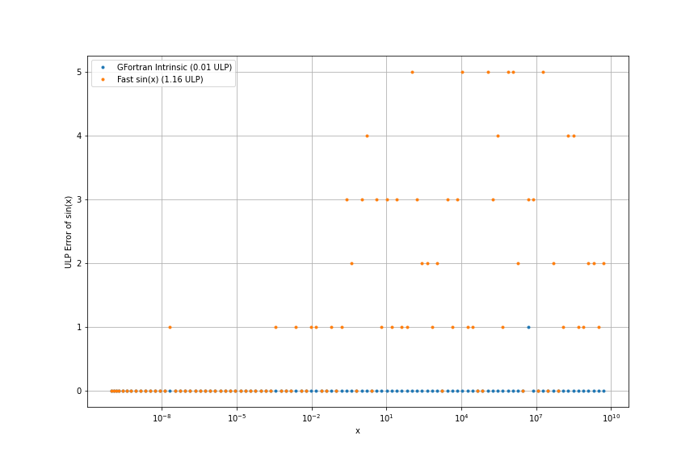

---
jupyter:
  jupytext:
    text_representation:
      extension: .md
      format_name: markdown
      format_version: '1.3'
      jupytext_version: 1.13.1
  kernelspec:
    display_name: Python 3 (ipykernel)
    language: python
    name: python3
---

# Designing Math Intrinsics for LFortran

Every Fortran, C and C++ compiler has a runtime library that implements math functions such as $\sin(x)$, $\cos(x)$, $\tan(x)$, $\exp(x)$, $\mathrm{erf}(x)$, etc. In this series of blog posts, we will investigate how to design and implement or reuse such functions to be used in any compiler. We will implement them in Fortran to be used by Fortran compilers such as LFortran, but the functions can be implemented in any language. We will explore from first principles how to go about designing such functions, and then we will implement the fastest possible version, benchmark it and prove that the performance is optimal using a theoretical peak performance analysis.


## Design

The domain of Fortran is high-performance numerical computing. A typical workflow is to compile in Debug mode, when the compiler instruments the code with runtime checks (such as array bounds checks) but does not do any optimizations and run the production code on production data to see whether any errors occur. If everything works then the code is recompiled in Release mode with all optimizations are turned on. One must then run the same production code and see if any answers have significantly changed. If everything looks good, one can then run a physical problem.

In Debug mode, it is a good idea to deliver full accuracy for intrinsic functions like $\sin(x)$, to reduce any potential source of errors. In Release mode, on the other hand, we typically want the absolute best performance (while still getting the correct answers).

For this reason, we have to ship with at least two sets of functions:

1. Accuracy first, performance second
2. Performance first, accuracy second

The accuracy first version is the one to be used in Debug mode. The goal is to get as accurate answers as possible for every single or double-precision number (no matter how large), and while keeping the accuracy, get the best performance possible. Examples of math functions that target accuracy first are the default `sin` function in GFortran, GCC, Clang, the `libm` library in `libc`, the `openlibm` library and many others. These functions are very accurate, typically they return the exactly rounded answer to the last bit (0 [ULP](https://en.wikipedia.org/wiki/Unit_in_the_last_place)) or the next floating-point number (1 ULP). There are even attempts to improve the accuracy further and implement functions that always return the exactly rounded answer. This amazing accuracy does not come for free. However, the implementations typically have to work very hard to get it, meanwhile sacrificing performance.

The goal of the performance first version (used in Release mode) is to obtain the best possible performance, and getting it as accurate as one can. Typically these functions have a reduced range of the argument for which the functions return valid answer (such as $|x| < 10^{10}$) and the accuracy of the answer is lower than the accuracy first version, such as "only" $10^{-15}$ relative accuracy. We wrote "only" because it is actually very high accuracy, but the error can be larger than 1 ULP. Together with the reduced range of an allowed argument that means such a fast function can potentially break some codes.

An idea of a good possible workflow is for the compiler to insert argument checks in Debug mode, and if the code passes, then one can switch to the fast functions. One still has to verify that the final accuracy is good enough for the given problem. If a given problem does not work with the fast functions, then one does not need to use them, one can always use the accuracy first versions. For many problems however the fast versions work great and deliver the best possible performance.

<!-- #region -->
## Accuracy


Now, Let us measure and compare the accuracy of various implementations:

* the default `sin(x)` in GFortran 9.3.0 on MacBook Pro 2019 (Intel based)
* Fast `sin(x)` with a simple reduction algorithm
* Fast `sin(x)` in pure Fortran
* Fastest possible very low accuracy `sin(x)`

Before comparsion, Let us look at the implemention of `fast with simple reduction`, `fast`, and `fastest` versions of `sin` functions.

```fortran
! Accurate on [-pi/2,pi/2] to about 1e-15 in relative accuracy
elemental real(dp) function kernel_sin(x) result(res)
real(dp), intent(in) :: x
real(dp), parameter :: S1 = 1
real(dp), parameter :: S2 = -0.16666666666665748417_dp
real(dp), parameter :: S3 = 8.333333333260810195e-3_dp
real(dp), parameter :: S4 = -1.9841269819408224684e-4_dp
real(dp), parameter :: S5 = 2.7557315969010714494e-6_dp
real(dp), parameter :: S6 = -2.5051843446312301534e-8_dp
real(dp), parameter :: S7 = 1.6047020166520616231e-10_dp
real(dp), parameter :: S8 = -7.360938387054769116e-13_dp
real(dp) :: z
z = x*x
res = x * (S1+z*(S2+z*(S3+z*(S4+z*(S5+z*(S6+z*(S7+z*S8)))))))
end function
```
We call this function in both `fast` versions. This function has pre-defined constants and  perform polynomial operation to get best possible accuracy.

### Fast with simple reduction version
```fortran
elemental real(dp) function fast_simple_reduction(x) result(r)
real(dp), intent(in) :: x
real(dp) :: y
integer :: N
N = nint(x/pi)
y = x-N*pi
if (modulo(N, 2) == 1) y = -y
r = kernel_sin(y)
end function
```
We split the two closest values and pass it to the `kernel_sin` function.

### Fast version
```fortran
subroutine kernel_fast(n, A, B)
use, intrinsic :: iso_fortran_env, only: dp => real64, i8 => int64
implicit none
integer(i8), value, intent(in) :: n
real(dp), intent(in) :: A(n)
real(dp), intent(out) :: B(n)
real(dp), parameter :: p1 = 3.14159202575683594e+00_dp
real(dp), parameter :: p2 = 6.27832832833519205e-07_dp
real(dp), parameter :: p3 = 1.24467443437932268e-13_dp
real(dp) :: x, Nd
integer(i8) :: i, xi
equivalence (x,xi)
do i = 1, n
    x = A(i)
    ! Prefereed way, but currently slow:
    !     Nd = nint(x/pi)
    ! Equivalent, fast today:
    Nd = int(x/pi + 0.5_dp*sign(1._dp, x))
    x = ((x - Nd*p1) - Nd*p2) - Nd*p3
    ! -pi/2 < x < pi/2
    ! For even Nd, we have sin(A(i)) = sin(x)
    ! For odd Nd,  we have sin(A(i)) = sin(x+pi) = -sin(x) = sin(-x)
    ! Preferred way, but currently slow:
    !     if (modulo(int(Nd), 2) == 1) x = -x
    ! Equivalent, floating point and integer representation dependent, but fast today:
    xi = xor(shiftl(int(Nd, i8),63), xi)
    B(i) = x
end do
do i = 1, n
    B(i) = kernel_sin(B(i))
end do
end subroutine
```

### Fastest version
```fortran
subroutine kernel_fastest(n, A, B) bind(c)
use, intrinsic :: iso_fortran_env, only: dp => real64, i8 => int64
implicit none
integer(i8), value, intent(in) :: n
real(dp), intent(in) :: A(n)
real(dp), intent(out) :: B(n)
real(dp), parameter :: S1 =  0.982396485658623
real(dp), parameter :: S2 = -0.14013802346642243
real(dp) :: x, z, Nd
integer(i8) :: i, xi
equivalence (x,xi)
do i = 1, n
    x = A(i)
    ! Prefereed way, but currently slow:
    !     Nd = nint(x/pi)
    ! Equivalent, fast today:
    Nd = int(x/pi + 0.5_dp*sign(1._dp, x))
    x = x - Nd*pi
    ! -pi/2 < x < pi/2
    ! For even Nd, we have sin(A(i)) = sin(x)
    ! For odd Nd,  we have sin(A(i)) = sin(x+pi) = -sin(x) = sin(-x)
    ! Preferred way, but currently slow:
    !     if (modulo(int(Nd), 2) == 1) x = -x
    ! Equivalent, floating point and integer representation dependent, but fast today:
    xi = xor(shiftl(int(Nd, i8),63), xi)
    z = x*x
    B(i) = x*(S1+z*S2)
end do
end subroutine
```
In the fastest version, we concentrate on speed with best possible accurcy.

> We will discuss and benchmark the fast `sin(x)` versions(performance) in the next blog post. Here we will measure their accuracy.

Relative error of above mentioned `sin(x)` implementations:


As you can see, the Fast simple reduction version(orange) does not have good enough accuracy. That is caused by the fact that in `y = y - nint(y/pi)*pi` we are subtracting two very close numbers and get catastrophic cancellation.

This issue is fixed by splitting `pi` into a sum of several numbers, each having a certain number of bits zeroed. By subtracting part by part, one obtains the exact answer up to what fits into a 32-bit integer, about $x = 4\times10^{9}$.

The fastest version has about 5% accuracy ($5\times10^{-2}$).

We can also compare errors in terms of [ULP](https://en.wikipedia.org/wiki/Unit_in_the_last_place) (Unit in the last place). Such an error can be computed using:
```python
@vectorize
def ulp_error(x:float, y:float):
    if x == y:
        return 0
    else:
        return abs(x-y)/math.ulp(max(abs(x), abs(y)))
```
Here, we are only comparing the fast version and the GFortran version:



As can be seen, the GFortran's version is extremely accurate, over 99% (TODO: determine the exact percentage) of the time it is exactly rounded for argument values in the interval $[0, 10^{10}]$. And in the rest of the time, it is the next floating-point number (1 ULP) to the exactly rounded answer.

On the other hand, the fast `sin(x)` version is still very accurate, up to 5 ULP with an average of 1.16 ULP. But it is not as accurate as GFortran's version.

The GFortran's version of sin(x) is within 1 ULP for all argument values up to the largest representable double precision number (~1e300). Our fast implementations only go to about ~1e10, because the modulo algorithm that we use only works up to about this size. If we wanted to go beyond that, it requires a more sophisticated beyond double precision reduction algorithm, which makes the code a lot slower. In practice, it seems that for most applications being able to do argument values up to 1e10 is enough. For those applications where that would not be enough, one would have to switch to the GFortran style sin(x) implementation which is slower, but accurate for any double precision number. Our fast implementation is thus not as versatile.

<!-- #endregion -->
