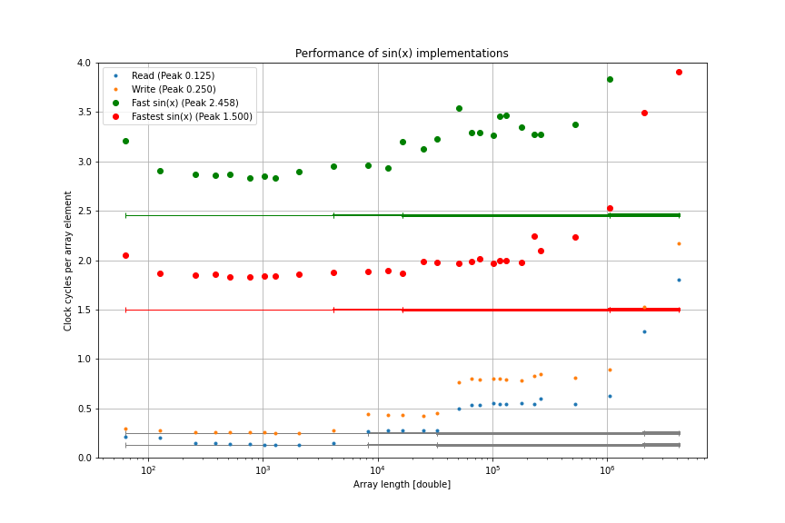
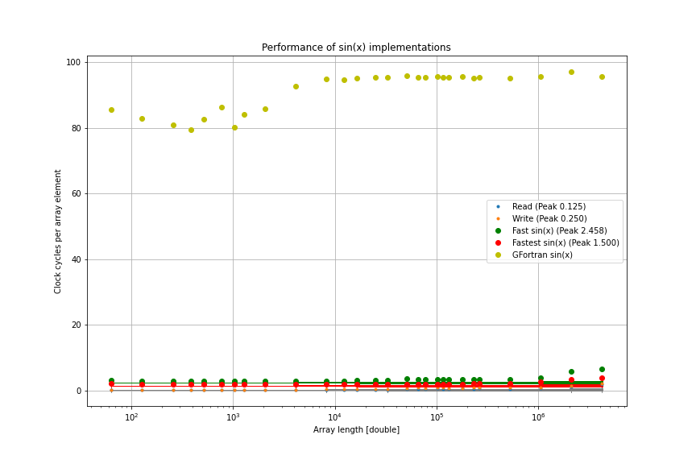

---
jupytext:
  formats: ipynb,md:myst
  text_representation:
    extension: .md
    format_name: myst
    format_version: 0.13
    jupytext_version: 1.12.0
kernelspec:
  display_name: Python 3 (ipykernel)
  language: python
  name: python3
---

# Designing Math Instrinsics for LFortran

Every Fortran (and C and C++) compiler has a runtime library that implements math functions such as $\sin(x)$, $\cos(x)$, $\tan(x)$, $\exp(x)$, $\mathrm{erf}(x)$, etc. In this series of blog posts we will investigate how to design and implement or reuse such functions to be used in any Fortran compiler, such as LFortran. We will explore from first principles how to go about designing such functions, and then we will implement the fastest possible version, benchmark it and prove that the performance is optimal using a theoretical peak performance analysis.

## Design

The domain of Fortran is high performance numerical computing. A typical workflow is to compile in Debug mode, when the compiler instruments the code with runtime checks (such as array bounds checks) but does not do any optimizations, and run the production code on production data to see whether any errors occur. If everything works then the code is recompiled in Release mode when all optimizations are turned on. One must then run the same problem and see if any answers have significantly changed. If everything looks good, one can then run a physical problem.

In Debug mode, it is a good idea to deliver full accuracy for intrinsic functions like $\sin(x)$, to reduce any potential source of errors. In Release mode, on the other hand, we typically want the absolute best performance (while still getting the correct answers).

For this reason, we have to ship with at least two sets of functions:

1. Accuracy first, performance second
2. Performance first, accuracy second

The accuracy first version is the one to be used in Debug mode. The goal is to get as accurate answer as possible for every single or double precision number (no matter how large), and while keeping the accuracy, get the best performance possible. Examples of math functions that target accuracy first are the default `sin` function in GFortran, GCC, Clang, the `libm` library in `libc`, the `openlibm` library and many others. These functions are very accurate, typically they return the exactly rounded answer to the last bit (0 ULP) or the next floating point number (1 ULP). There are even attempts to improve the accuracy further and implement functions that always return the exactly rounded answer. This amazing accuracy does not come for free however. The implementations typically have to work very hard to get it, sacrificing performance.

The goal of the performance first version is to obtain the best possible performance. And while keeping the good performance as much as possible, get it as accurate as one can get. Typically these functions have a reduced range of the argument for which the functions return valid answer (such as $|x| < 10^{10}$) and the accuracy of the answer is lower than the accuracy first version, such as "only" $10^{-15}$ relative accuracy. We wrote "only" because it is actually very high accuracy, but the error can be larger than 1 ULP. Together with the reduced range of an allowed argument that means such fast function can potentially break some codes.

An idea of a good possible workflow is for the compiler to insert argument checks in Debug mode, and if the code passes, then one can switch to the fast functions. One still has to verify that the final accuracy is good enough for the given problem. If a given problem does not work with the fast functions, then one does not need to use them, one can always use the accuracy first versions. For many problems however the fast versions work great and deliver the best possible performance.

+++

## Accuracy

In this post we will measure accuracy of various implementations. We will compare:

* the default `sin(x)` in GFortran 9.3.0 on MacBook Pro 2019 (Intel based)
* Fast `sin(x)` in pure Fortran
* Fast `sin(x)` with a simple reduction algorithm
* Fastest possible very low accuracy `sin(x)`

We will discuss and benchmark the fast `sin(x)` versions in the next blog post. Here we will measure their accuracy.

Relative error of various `sin(x)` implementations:


As you can see, the simple reduction version does not have good enough accuracy. That is caused by the fact that in `y = y - nint(y/pi)*pi` we are subtracting two very close numbers and get catastrophic cancellation.

This issue is fixed by splitting `pi` into a sum of several numbers, each having certain number of bits zeroed. By subtracting part by part, one obtains the exact answer up to what fits into a 32 bit integer, about $x = 4\times10^{9}$.

The fastest version has about 5% accuracy ($5\times10^{-2}$).

We can also compare errors in terms of [ULP](https://en.wikipedia.org/wiki/Unit_in_the_last_place) (Unit in the last place). Such an error can be computed using:
```python
@vectorize
def ulp_error(x:float, y:float):
    if x == y:
        return 0
    else:
        return abs(x-y)/math.ulp(max(abs(x), abs(y)))
```
We will only compare the fast version and GFortran version:


As can be seen, the GFortran's version is extremely accurate, over 80% of the times it is exactly rounded, and in the rest of the time it is the next floating point number (1 ULP) to the exactly rounded answer.

The fast `sin(x)` version is still very accurate, up to 5 ULP with the average 1.16 ULP. But it is not as accurate as the GFortran's version.

+++

## Performance

In this blog post we will obtain theoretical and actual performance of the implementations. Let us start with the fastest version:
```fortran
subroutine sin_fastest(n, A, B)
! Intel: runs at 1.8 cycles per double; Peak:: 1.458
use iso_fortran_env, only: dp=>real64
implicit none
integer, intent(in) :: n
real(dp), intent(in) :: A(n)
real(dp), intent(out) :: B(n)
real(dp), parameter :: S1 =  0.982396485658623
real(dp), parameter :: S2 = -0.14013802346642243
real(dp), parameter :: pi = 3.1415926535897932384626433832795_dp
real(dp) :: x, z, Nd
integer :: i, xi
equivalence (x,xi)
do i = 1, n
    x = A(i)
    ! Prefereed way, but currently slow:
    !     Nd = nint(x/pi)
    ! Equivalent, fast today:
    Nd = int(x/pi + 0.5_dp*sign(1._dp, x))
    x = x - Nd*pi
    ! -pi/2 < x < pi/2
    ! For even Nd, we have sin(A(i)) = sin(x)
    ! For odd Nd,  we have sin(A(i)) = sin(x+pi) = -sin(x) = sin(-x)
    ! Preferred way, but currently slow:
    !     if (modulo(int(Nd), 2) == 1) x = -x
    ! Equivalent, floating point and integer representation dependent, but fast today:
    xi = xor(shiftl(int(Nd),63), xi)
    z = x*x
    B(i) = x*(S1+z*S2)
end do
end subroutine
```

Let us determin the theoretical performance peak. We count the number of operations that absolutely have to happen at the CPU, no matter how this is compiled. Looking at the body of the loop, we see one double precision floating point memory read (R) from `A(i)`, one memory write to `B(i)`, two multiplications (`x*x` and `x*(...)`), 3 fused multiply-adds (`x/pi + 0.5_dp*sign(...)`, `x - Nd*pi` and `S1+z*S2`), one double precision float to int conversion / truncation (`int(x/pi + 0.5_dp*sign(...))`) and one int to float conversion (`Nd = int(...)`). There is a `if (modulo(int(Nd), 2) == 1) x = -x` operation and we would like to write it as such, but unfortunately the Fortran compilers do not generate optimal code for it, which in this case on x86 architectures can be implemented using a shift and xor operations. So until compilers improve (we would like LFortran to optimize this well), we use shift and xor directly. It seems this is the most efficient way to implement it, so we count the cost of shift and xor into the performance peak. Similarly, the `nint(x/pi)` operation (rounding) would be the preferred way to write the algorithm, but unfortunately compilers do not currently generate optimal code, so we force it by doing an equivalent operation `int(x/pi + 0.5_dp*sign(1._dp, x))` and include the cost of one fma and one float to int conversion. We do not count the `0.5_dp*sign(1._dp, x)` operation into the peak as an additional multiplication and sign operation because there might be some fast way to do it with bit manipulation that does not involve multiplication and that can potentially be done at the same time as other operations by the CPU. Summary:

| Operation  | Count |
| ---------- | ----- |
| R          |   1   |
| W          |   1   |
| *          |   2   |
| FMA        |   3   |
| float->int |   1   |
| int->float |   1   |
| Bit Shift  |   1   |
| XOR        |   1   |

Now we lookup the maximum throughputs of these operations on the 2019 MacBook Pro. It seems it is using the Intel Core [i9-9980HK](https://www.intel.com/content/www/us/en/products/sku/192990/intel-core-i99980hk-processor-16m-cache-up-to-5-00-ghz/specifications.html) processor, the microarchitecture name is [Coffee Lake](https://en.wikipedia.org/wiki/Coffee_Lake). We go to the Agner Fog's [Instruction tables](https://www.agner.org/optimize/instruction_tables.pdf), find the `Coffee Lake` section and use the "Reciprocal throughput" column which lists the number of clock cycles per instruction. This CPU can operate on 256bit `ymm` registers, each of which can contain 4 double precision (64bit) floating point numbers. We want the throughput per double, so we divide the "Reciprocal throughput" by 4. We obtain the following:

```{code-cell} ipython3
T = {
    "R": 0.125, # vmovaps y,m256 takes 0.5 cycles
    "W": 0.25,  # vmovaps m256,y takes 1 cycle
    "*": 0.125, # vmulpd takes 0.5 cycles
    "+": 0.125, # vaddpd takes 0.5 cycles
    "fma": 0.125, # vfmadd... family of instructions all take 0.5 cycles
    "xor": 0.0825, # takes 0.33 cycles
    "shift": 0.25, # vpsllq takes 1 cycle
    "float<->int": 0.25, # vcvtdq2pd and vcvttpd2dq each take 1 cycle
}
```

Now we use the above table with operation counts and these throughputs to obtain the theoretical performance peak. The CPU can do the following operations at the same time:

* R (total throughput 0.125 cycles per double)
* W (total throughput 0.25 cycles per double)
* Arithmetic operations (total throughput 1.4575 cycles per double, see below)

As we can see, the limiting factor are arithmetic operations in this case, so we do not include the cost of R and W into the theoretical performance peak. Finally, on older Intel architectures such as Sandy Bridge, the CPU had separate units for multiplication and addition, so it could do these two operations at maximum throughput at the same time. The Coffee Lake architecture has units that are used for all arithmetic operations, so we have to add all the throughputs together. We obtain the following theoretical peak performance in cycles per double:

```{code-cell} ipython3
fastest_peak = 2*T["*"] + 3*T["fma"] + 2*T["float<->int"] + T["shift"] + T["xor"]
fastest_peak
```

Doing exactly the same analysis for the full fast `sin(x)` implementation yields:

| Operation  | Count |
| ---------- | ----- |
| R          |   1   |
| W          |   1   |
| *          |   2   |
| FMA        |  11   |
| float->int |   1   |
| int->float |   1   |
| Bit Shift  |   1   |
| XOR        |   1   |

```{code-cell} ipython3
fast_peak = 2*T["*"] + 11*T["fma"] + 2*T["float<->int"] + T["shift"] + T["xor"]
fast_peak
```

We can now benchmark the actual implementations. To do so, we first write assembly kernels for just memory reads and writes (16 times unrolled). We independently verify that this implementation is optimal and that both theoretical (0.125 and 0.25 cycles per double respectively) and actual speeds agree. We then compile these two kernels and the actual `sin(x)` implementation that we are measuring as separate compilation units and the benchmark driver is then repeatedly calling these on arrays of various sizes. For each size it benchmarks read, write and the `sin(x)` function. We then use the reference read/write benchmarks to compute the actual CPU frequency. For the MacBook Pro it happens to vary between 3.5 GHz to 4.5 GHz, but it seems stable enough for the given run as seen from the graph below, the read/write reference benchmarks are right on the theoretical peak line. Here are the benchmark results:

+++



We can plot the speed of the GFortran's sin(x):


